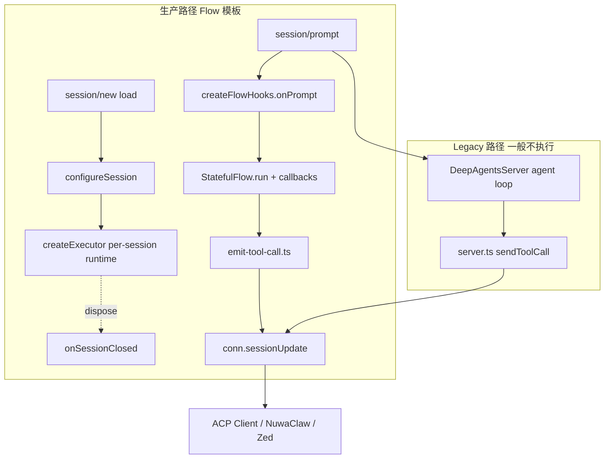

# 架构：两条 ACP 出站路径

[← 返回索引](./README.md)

---

| 路径 | 源码 | 何时执行 | 规范符合度 |
| --- | --- | --- | --- |
| **Flow（主路径）** | `src/surfaces/acp/` | `onPrompt` 短路 agent，图经 `materializeFlow` 执行 | **已按官方 schema 对齐核心字段**（见 [field-mapping.md](./field-mapping.md)） |
| **deepagents-acp（Legacy）** | `src/libs/deepagents-acp/server.ts` | throwaway `DeepAgent` 未短路时 | **未对齐**（仍用 `input`/`output`，见 [legacy-path.md](./legacy-path.md)） |

Flow 模板部署（NuwaClaw / 平台 ACP）**只走 Flow 路径**。维护工具调用展示、ask-question 表单等问题时，**优先改 `surfaces/acp`**，不要只改 `deepagents-acp`。

---

## ToolKind / ToolCallStatus 枚举

**ToolKind**（官方）：`read` | `edit` | `delete` | `move` | `search` | `execute` | `think` | `fetch` | `other`  
映射：[`adapter.ts` getToolCallKind](../../../../../packages/deepagents-flow-ts/src/libs/deepagents-acp/adapter.ts)

**ToolCallStatus**（官方）：`pending` | `in_progress` | `completed` | `failed`  
Flow 主路径使用：`in_progress` → `completed` | `failed`

参考实现首包常用 `pending`；flow-ts 使用 `in_progress`，客户端通常均可接受。

---

## 会话生命周期（per-session runtime）

`createFlowHooks`（[`surfaces/acp/server.ts`](../../../../../packages/deepagents-flow-ts/src/surfaces/acp/server.ts)）暴露三种装配模式：

| 模式 | 触发 | 说明 |
| --- | --- | --- |
| **per-session 工厂**（`createExecutor`，主路径） | `configureSession` | 按 ACP `cwd`/`mcpServers`/`model`/`systemPrompt` 装配**每会话独立** runtime（ACP 最高优先级），缓存在 `sessions` Map |
| 单 executor（`executor`） | `onPrompt` 直接用 | 兼容旧 examples |
| 懒建兜底 | `onPrompt` | `configureSession` 未触发时合并 env + 进程 cwd 建 |

`configureSession(phase:"new"|"load")` → `createExecutor` → `SessionExecutor{ executor, dispose }`；`onSessionClosed` 调 `dispose` 释放（MCP stdio 子进程等）。配置解析与诊断见 [dataflow-nuwaclaw.md §会话配置](./dataflow-nuwaclaw.md#会话配置sessionnewload--per-session-runtime)。

> **hooks 契约**（[`types.ts` DeepAgentsServerHooks](../../../../../packages/deepagents-flow-ts/src/libs/deepagents-acp/types.ts)）：`configureSession` / `onPrompt` / `onPromptComplete` / `onPromptError` / `onSessionClosed` / `getSessionHistory`（Flow surface **未实现** getSessionHistory）。
