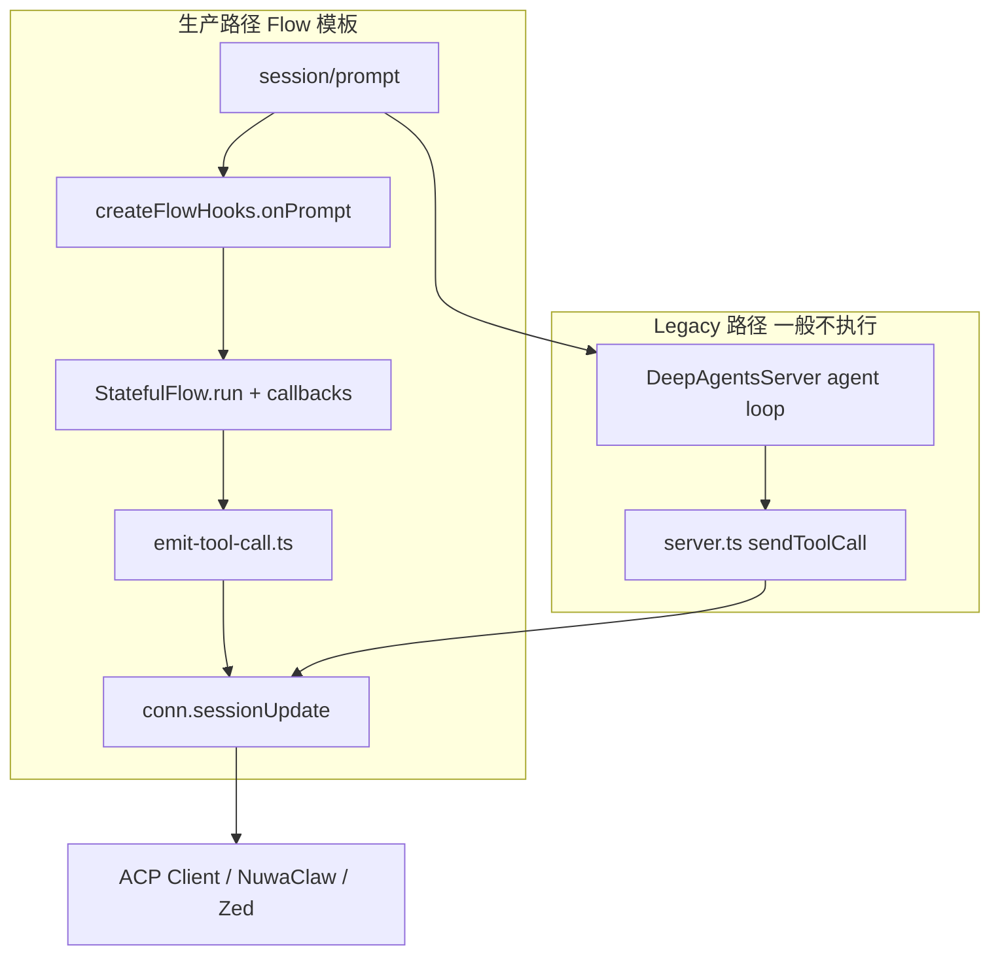

# 架构：两条 ACP 出站路径

[← 返回索引](./README.md)

---

| 路径 | 源码 | 何时执行 | 规范符合度 |
| --- | --- | --- | --- |
| **Flow（主路径）** | `src/surfaces/acp/` | `onPrompt` 短路 agent，图经 `materializeFlow` 执行 | **已按官方 schema 对齐核心字段**（见 [field-mapping.md](./field-mapping.md)） |
| **deepagents-acp（Legacy）** | `src/libs/deepagents-acp/server.ts` | throwaway `DeepAgent` 未短路时 | **未对齐**（仍用 `input`/`output`，见 [legacy-path.md](./legacy-path.md)） |

Flow 模板部署（NuwaClaw / 平台 ACP）**只走 Flow 路径**。维护工具调用展示、ask-question 表单等问题时，**优先改 `surfaces/acp`**，不要只改 `deepagents-acp`。

---

## ToolKind / ToolCallStatus 枚举

**ToolKind**（官方）：`read` | `edit` | `delete` | `move` | `search` | `execute` | `think` | `fetch` | `other`  
映射：[`adapter.ts` getToolCallKind](../../../../../packages/deepagents-flow-ts/src/libs/deepagents-acp/adapter.ts)

**ToolCallStatus**（官方）：`pending` | `in_progress` | `completed` | `failed`  
Flow 主路径使用：`in_progress` → `completed` | `failed`

参考实现首包常用 `pending`；flow-ts 使用 `in_progress`，客户端通常均可接受。
