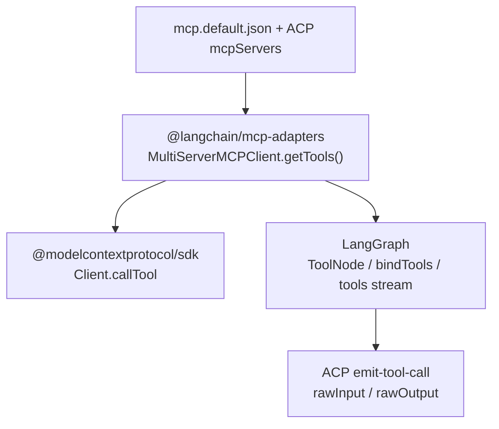
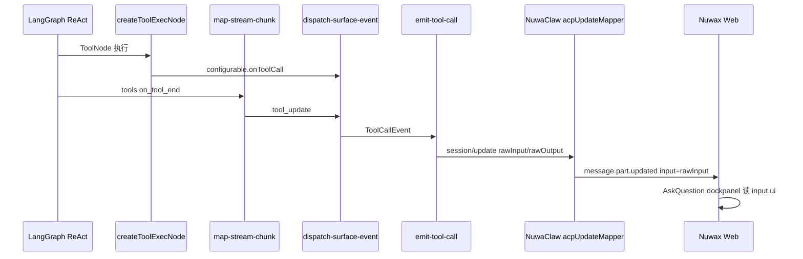

# 端到端数据流（Flow → NuwaClaw）

[← 返回索引](./README.md)

---

## MCP 标准栈（LangGraph + MCP 官方接入）

本包 **不** 自研 MCP JSON-RPC，也不手写 tools/call。三层官方栈：

| 层 | 包 / API | 职责 |
| --- | --- | --- |
| **LangGraph** | `ToolNode` / `createToolExecNode` · `bindTools` · `streamMode: "tools"` | MCP 工具作为 native `StructuredTool` 进图；`on_tool_*` 经 callbacks → ACP |
| **LangChain 适配** | [`@langchain/mcp-adapters`](https://github.com/langchain-ai/langchain-mcp-adapters) `MultiServerMCPClient.getTools()` | MCP server → LangChain `StructuredTool[]`（`prefixToolNameWithServerName`） |
| **MCP 协议** | [`@modelcontextprotocol/sdk`](https://github.com/modelcontextprotocol/typescript-sdk) `Client` | `tools/list`、`tools/call`；`CallToolResult.content` + `structuredContent` |
| **配置** | `config/mcp.default.json` + ACP `session/new` `mcpServers` | session-wins 合并 |

**LangGraph 侧入口**（与 [LangChain MCP 文档](https://docs.langchain.com/oss/javascript/langchain/mcp) 一致）：

1. [`hydrateRuntimeContext()`](../../../../../packages/deepagents-flow-ts/src/runtime/context/runtime-context.ts) — `client.getTools()` → `ctx.mcpTools`
2. [`flow-tools.ts`](../../../../../packages/deepagents-flow-ts/src/app/flow-tools.ts) — 合并进 `allTools` → think `bindTools`
3. [`createToolExecNode`](../../../../../packages/deepagents-flow-ts/src/libs/nodes/tools.ts) — 包装 `@langchain/langgraph/prebuilt` `ToolNode`
4. [`map-stream-chunk.ts`](../../../../../packages/deepagents-flow-ts/src/surfaces/map-stream-chunk.ts) — `streamMode: "tools"` → `on_tool_start` / `on_tool_end`

工具结果：`CallToolResult.structuredContent` → ACP `rawOutput`；`structuredContent.input` → ACP `rawInput`（[`tool-result-normalize.ts`](../../../../../packages/deepagents-flow-ts/src/libs/nodes/tool-result-normalize.ts)）。

---

---

## 内部事件契约：`ToolCallEvent`

定义：[`src/core/flow-types.ts`](../../../../../packages/deepagents-flow-ts/src/core/flow-types.ts)

| 阶段 | `status` | 映射到 ACP |
| --- | --- | --- |
| 开始 | `in_progress` | `tool_call` + `rawInput` |
| 成功 | `completed` | `tool_call_update` + `rawOutput` + `content` |
| 失败 | `failed` | `tool_call_update` + `content`（错误文本） |

---

## 工具结果来源（双轨，注意去重）

| 来源 | 文件 | 说明 |
| --- | --- | --- |
| 节点直出 | `libs/nodes/tools.ts` → `configurable.onToolCall` | 推荐；args 完整 |
| Stream | `map-stream-chunk.ts` → `dispatch-surface-event.ts` | `on_tool_end` 解析；`output===undefined` 的 completed **跳过** |

`buildAcpCallbacks` 用 `inflightTools: Map<toolCallId, ToolCallEvent>` 在 completed 时回填 `rawInput`。

---

## NuwaClaw 宿主契约（非 ACP 官方，但生产必知）

| 层级 | 行为 |
| --- | --- |
| `acpUpdateMapper` | `tool_call` / `tool_call_update` 只映射 **`rawInput` / `rawOutput`**，不读 `input` |
| Web / Backend | `Backend.Sandbox.Event.AskQuestion` 需 `rawInput` 含 **`schemaVersion` + `toolName` + `ui.version`**（MCP 服务端补齐） |
| MCP→ACP 通用约定 | `CallToolResult.structuredContent` → ACP `rawOutput`；`structuredContent.input` → ACP `rawInput`（交互式工具） |
| ask-question 实例 | 见 nuwaclaw `docs/mcp-ask-question-acp-toolcall-v1.md` |

**历史故障**：
- 仅发 `input` 不发 `rawInput` → 宿主 `input=null`（2026-06 已修）
- 只回填 LLM args、丢弃 MCP `structuredContent.input` → 缺 `ui.version` → 只出 `ToolCall` 不出 `AskQuestion` Event（2026-06-27 已修）
