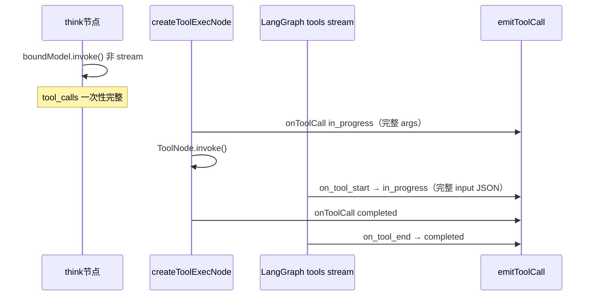

# 阶段 C 调研：LangGraph 流式 toolCallId / alreadyCached

[← 返回路线图](./roadmap-progress.md)

**调研日期**：2026-06-27  
**结论**：**当前架构下不需要 `alreadyCached` 式流式精炼 `rawInput`**；存在可选的 **重复 `tool_call` 去重** 小优化。

---

## 1. 参考实现在做什么

[claude-code-acp-ts `acp-agent.ts`](https://github.com/nuwax-ai/claude-code-acp-ts) 在 `tool_use` 流式处理中：

```
首次 chunk  → sessionUpdate: tool_call      + rawInput（可能不完整）+ status: pending
二次同一 id → sessionUpdate: tool_call_update + rawInput（完整参数）精炼 title/kind/locations
```

触发原因：Claude Agent SDK **同一次 tool_use 会经历「流式 content_block」与「完整 message 回放」两次**，第二次用 `tool_call_update` 避免重复 `tool_call`。

---

## 2. flow-ts 实际数据流



### 2.1 think 节点不流式 tool args

[`app/nodes/think.ts`](../../../../../packages/deepagents-flow-ts/src/app/nodes/think.ts) 使用 `invokeWithResilience(boundModel, ...)` **非** `stream()`。  
`AIMessage.tool_calls` 仅在整轮 LLM 返回后才有，**不存在** `input_json_delta` 式增量参数。

### 2.2 tools 流：`on_tool_start` 一次、参数已完整

[`map-stream-chunk.ts`](../../../../../packages/deepagents-flow-ts/src/surfaces/map-stream-chunk.ts) 注释与实现：

- `tools` 模式：`on_tool_start` 带 **完整** `input` JSON 字符串
- `on_tool_end` 带 ToolMessage 序列化结果
- **无** `on_tool_progress` / 增量 args 事件

### 2.3 双轨 in_progress（非精炼，是重复）

| 来源 | 时机 | toolCallId | args |
| --- | --- | --- | --- |
| `createToolExecNode` | ToolNode 执行前 | LangGraph `tool_calls[].id` | 完整 |
| `tools` stream `on_tool_start` | ToolNode 内部 | 同上 | 完整（JSON 解析后） |

两路都走 `configurable.onToolCall` → `emitToolCall`。~~当前对 `in_progress` **始终发 `tool_call`**，可能 **同一 id 发两次 `tool_call`**~~ **C-dedupe（2026-06-27）**：首包 `tool_call`，二次 `tool_call_update`。

[`dispatch-surface-event.ts`](../../../../../packages/deepagents-flow-ts/src/surfaces/dispatch-surface-event.ts) 在 `tool_update` completed 且 `output===undefined` 时已跳过，避免空 completed 覆盖节点结果。

---

## 3. 结论与建议

| 问题 | 答案 |
| --- | --- |
| LangGraph 是否对同一 `toolCallId` **流式**多次 `on_tool_start` 且 args 递增？ | **否**（当前版本 + 当前图） |
| 是否需要对齐 `alreadyCached` 做 **rawInput 精炼**？ | **暂不需要** |
| 是否有重复出站？ | ~~**可能**~~ **已修复**：C-dedupe 双端 —— `emittedToolCallIds`（二次 in_progress→`tool_call_update`）+ `completedToolCallIds`（二次 terminal→跳过，防无 `rawInput` 的 completed 覆盖首包）；详见 [field-mapping.md §双轨去重](./field-mapping.md#双轨去重emit-tool-callts) |

### 建议优先级

| 优先级 | 项 | 说明 |
| --- | --- | --- |
| P3 可选 | ~~**C-dedupe**~~ | ✅ 已完成 |
| P4 未来 | **C-stream-think**：think 改 `stream()` + 解析 `tool_call_chunks` 再发增量 `rawInput` | 工作量大，需产品要「边生成边展示工具参数」 |
| — | 原 C-1~C-3「流式精炼」任务 | **搁置**，待 think 流式化再 reopen |

| ID | 任务 | 状态 |
| --- | --- | --- |
| C-1 | 调研 LangGraph 重复 `on_tool_start` | ✅ 2026-06-27 |
| C-2 | `emittedToolCallIds`（in_progress）+ `completedToolCallIds`（terminal）双端去重 | ✅ 见 `emit-tool-call.ts` |
| C-3 | 流式 args `tool_call_update` 精炼 | ❌ 搁置（think 非流式） |
