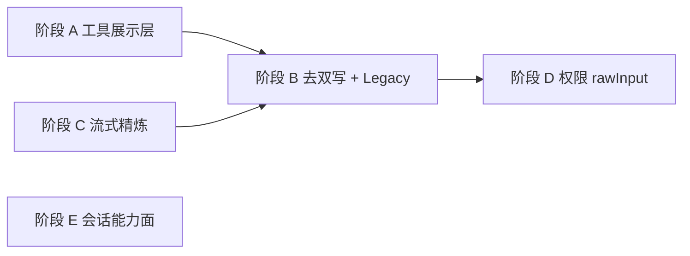

# claude-code-acp-ts 追赶路线图与进度

[← 返回索引](./README.md)

> 参考实现：[nuwax-ai/claude-code-acp-ts](https://github.com/nuwax-ai/claude-code-acp-ts)（本地 `~/workspace/claude-code-acp-ts`）  
> 完整度对照：[reference-implementation.md](./reference-implementation.md)

**最后更新**：2026-06-27（阶段 A + B + D 已落地）

---

## 总览

| 阶段 | 优先级 | 状态 | 说明 |
| --- | --- | --- | --- |
| **前置** | — | ✅ 完成 | `rawInput`/`rawOutput`、`emit-tool-call`、ask-question 修复 |
| **A** | P1 | ✅ 完成 | `libs/deepagents-acp/acp-tool-presentation.ts` |
| **B** | P2 | ✅ 完成 | 去掉 `input`/`output`；Legacy 与 Flow 统一 |
| **C** | P2 | ⏸️ 搁置精炼 | 调研完成：think 非流式，无增量 rawInput；见 [phase-c-streaming-research.md](./phase-c-streaming-research.md) |
| **C-dedupe** | P3 | ✅ 完成 | `emittedToolCallIds`；二次 in_progress → `tool_call_update` |
| **D** | P2 | ✅ 完成 | `requestPermission` + `buildPermissionToolCall` |
| **E** | P3 | ⏸️ 暂缓 | 用量 / 模式面暂不实施；调研见 [phase-e-capabilities-research.md](./phase-e-capabilities-research.md) |

---

## 阶段 A — 工具出站完整度（P1）✅

**实现位置**：[`libs/deepagents-acp/acp-tool-presentation.ts`](../../../../../packages/deepagents-flow-ts/src/libs/deepagents-acp/acp-tool-presentation.ts)（Flow + Legacy 共用，非 `surfaces/`——分层约束）

| 函数 | 职责 |
| --- | --- |
| `toolInfoFromToolEvent` | `tool_call` → title / kind / locations / diff |
| `toolUpdateFromToolResult` | `tool_call_update` → content / rawOutput |
| `preserveRawOutput` | MCP structuredContent 或原貌 |
| `buildPermissionToolCall` | 阶段 D 权限请求载荷 |

### 任务清单

| ID | 任务 | 状态 | 完成日 |
| --- | --- | --- | --- |
| A-1 | 新建 `acp-tool-presentation.ts` | ✅ | 2026-06-27 |
| A-2 | `emit-tool-call` 接入 presentation + `workspaceRoot` | ✅ | 2026-06-27 |
| A-3 | `rawOutput` 原貌优先 | ✅ | 2026-06-27 |
| A-4 | `tests/acp-tool-presentation.test.ts` | ✅ | 2026-06-27 |
| A-5 | 更新 field-mapping.md | ✅ | 2026-06-27 |

---

## 阶段 B — 协议洁癖 + Legacy 统一（P2）✅

| ID | 任务 | 状态 | 完成日 |
| --- | --- | --- | --- |
| B-1 | `emit-tool-call.ts` 删除 `input`/`output` | ✅ | 2026-06-27 |
| B-2 | env `ACP_LEGACY_INPUT_OUTPUT` 过渡 | — 跳过 | NuwaClaw 已只读 rawInput/rawOutput |
| B-3 | `deepagents-acp/server.ts` 共用 presentation | ✅ | 2026-06-27 |
| B-4 | `pnpm test` 回归（326 passed） | ✅ | 2026-06-27 |

---

## 阶段 C — 流式 toolCallId / alreadyCached ⏸️

**调研文档**：[phase-c-streaming-research.md](./phase-c-streaming-research.md)

**结论（2026-06-27）**：

- `think` 节点用 `invoke()`，**不流式**输出 `tool_calls` → 无增量 `rawInput`
- LangGraph `tools` 模式：`on_tool_start` **一次**、参数已完整 JSON
- **不需要**对齐 claude-code-acp-ts 的 `alreadyCached` 精炼逻辑（除非未来 think 改 stream）
- **可选**：~~`createToolExecNode` 与 `tools` stream 双轨各发 `in_progress`，可能 **重复 `tool_call`**~~ → ✅ **C-dedupe** 已落地

| ID | 任务 | 状态 | 完成日 |
| --- | --- | --- | --- |
| C-1 | 调研 LangGraph 重复 `on_tool_start` / 流式 args | ✅ | 2026-06-27 |
| C-2 | 首包 Set 去重 / 二次改 `tool_call_update` | ✅ | 2026-06-27 |
| C-3 | think 流式 + 增量 rawInput | ❌ 搁置 | |

---

## 阶段 D — 权限请求对齐（P2）✅

| ID | 任务 | 状态 | 完成日 |
| --- | --- | --- | --- |
| D-1 | `requestToolPermission` → `buildPermissionToolCall` | ✅ | 2026-06-27 |
| D-2 | 复用 `toolInfoFromToolEvent` | ✅ | 2026-06-27 |

---

## 阶段 E — 会话能力面（P3）⏸️ 暂缓

**决策（2026-06-27）**：**暂时不考虑** `usage_update`、模式切换等会话能力面；不影响工具出站与 ask-question 正确性。

**调研文档**（归档参考）：[phase-e-capabilities-research.md](./phase-e-capabilities-research.md)

| 能力 | 建议 |
| --- | --- |
| `usage_update` | 有用量/计费 UI 需求时做；数据已在 `llm-resilience` 日志 |
| `current_mode_update` | 宿主支持 plan/ask 切换时做 |
| `available_commands_update` | Flow 无 slash，Legacy 已有 |
| 终端 `_meta` | flow 无 Bash 终端，不做 |

---

## 现状快照（对比参考实现）

| 维度 | claude-code-acp-ts | flow-ts |
| --- | --- | --- |
| `rawInput` / `rawOutput` 核心 | ✅ | ✅ |
| `locations` / `diff` | ✅ | ✅ |
| 非官方 `input`/`output` | 从不发 | ✅ 已移除 |
| 流式 rawInput 精炼 | ✅ | ⏸️ 不需要（架构不同） |
| 重复 tool_call 去重 | SDK 双次回放 | ✅ C-dedupe |
| 权限 `rawInput` | ✅ | ✅ |
| `usage_update` / 模式面 | ✅ | ⏸️ 暂缓（非当前范围） |

---

## 下一批建议

1. ~~**C-dedupe**~~ ✅ 已完成  
2. ~~**阶段 E**（用量 / 模式）~~ ⏸️ 暂缓，不在当前路线图  
3. **生产验证**：NuwaClaw 上 `read_file` + `ask-question` 工具展示
