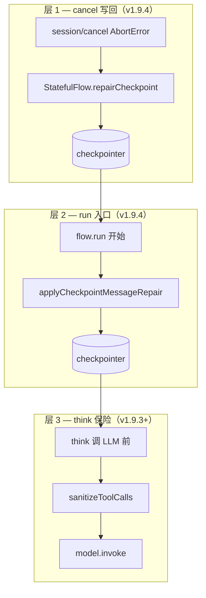

# Checkpoint 完整性与 ACP systemPrompt 解析（v1.9.2–v1.9.4）

> **状态**：✅ 现行（`deepagents-flow-ts` **v1.9.4**）  
> **受众**：Monorepo 维护者；改 `resolveSystemPrompt`、`think`、`stateful-flow`、ACP cancel 或 checkpointer 时必读。  
> **使用者排障**：包内 [troubleshooting.md §400 INVALID_TOOL_RESULTS](../../../../packages/deepagents-flow-ts/docs/troubleshooting.md#400-invalid_tool_results--checkpoint-损坏)

2026-07 线上「宣传公司」等项目暴露两类独立故障，已在模版侧闭合：

1. **ACP `systemPrompt` 覆盖本地身份** → 误调工具 → 更容易触发 cancel / 400  
2. **cancel 中断 ToolNode** → checkpoint 孤立 `tool_calls` → 后续每轮 `400 INVALID_TOOL_RESULTS`

---

## 1. 问题与症状

| 故障 | 典型症状 | 根因 |
| --- | --- | --- |
| **提示词被覆盖** | Agent 不像 `prompts/flow.base.md` 定义的角色；误调 `web_search_*` 等 | `resolveSystemPrompt` 曾把 ACP session 提示词**替换**本地文件 |
| **checkpoint 损坏** | 「抱歉，处理您的问题时出现错误」；日志 `400 INVALID_TOOL_RESULTS`；`sessionId=pending` 反复失败 | `think` 后 `AIMessage(tool_calls)` 已落盘，`session/cancel` 在 tools 未完成时中断，无对应 `ToolMessage` |

两类问题症状相似，需分开排查（见包内 troubleshooting）。

---

## 2. systemPrompt 解析（v1.9.2+）

**语义**：平台 `_meta.systemPrompt = { append: "..." }` 是**补充指令**，不覆盖项目身份。

**实现**：[`prompt.ts`](../../../../packages/deepagents-flow-ts/src/runtime/context/prompt.ts) `resolveSystemPromptMeta`：

```
有 sessionConfig.systemPrompt:
  prompts/flow.base.md（或 systemPromptPath）
  + ACP session 补充文本
  + PLATFORM_CONVENTIONS

无 session:
  config.agent.systemPrompt（内联）
  > systemPromptPath 文件
  > inline fallback
```

**解析入口**（不变）：[`session-config.ts`](../../../../packages/deepagents-flow-ts/src/surfaces/acp/session-config.ts) `coalesceSystemPromptValue` → `createFlowRuntime` → `resolveSystemPrompt`。

**诊断**：`logConfigureSessionDiagnostics` / `predictSystemPromptSource`（[`session-diagnostics.ts`](../../../../packages/deepagents-flow-ts/src/surfaces/acp/session-diagnostics.ts)）。

---

## 3. Checkpoint 三层防御（v1.9.3 + v1.9.4）



| 层 | 时机 | 行为 | 是否写回磁盘 |
| --- | --- | --- | --- |
| **1** | ACP `session/cancel`（`AbortError`） | 为 in-flight `tool_call_id` 补 synthetic `ToolMessage`，再 sanitize | ✅ `updateState` + `RemoveMessage` |
| **2** | 每次 `createStatefulFlow.run` 入口 | 读 checkpoint → sanitize 孤立 `tool_calls` | ✅ 同上 |
| **3** | `think` 调 LLM 前 | `sanitizeToolCalls(state.messages)` | ❌ 仅内存（最后一道保险） |

**共享模块**：[`src/libs/messages/`](../../../../packages/deepagents-flow-ts/src/libs/messages/)

| 文件 | 职责 |
| --- | --- |
| `sanitize-tool-calls.ts` | `msgType` / plain object 兼容；`findOrphanedToolCallIds`；`sanitizeToolCalls` |
| `repair-checkpoint.ts` | `completeOrphanedToolCalls`；`checkpointRepairUpdate`（compaction 同款 RemoveMessage）；`applyCheckpointMessageRepair` |

**写回约束**：消息须有 LangChain `id` 才能 `RemoveMessage` 替换；无 `id` 的反序列化 plain object 跳过磁盘修复，依赖层 3。

**接线**：

- [`stateful-flow.ts`](../../../../packages/deepagents-flow-ts/src/surfaces/stateful-flow.ts) — `run` 入口 + `flow.repairCheckpoint`
- [`server.ts`](../../../../packages/deepagents-flow-ts/src/surfaces/acp/server.ts) — cancel 分支调 `repairCheckpoint(inflightTools.keys())`
- [`think.ts`](../../../../packages/deepagents-flow-ts/src/app/nodes/think.ts) — 导入 `sanitizeToolCalls`

**契约**：[`flow-types.ts`](../../../../packages/deepagents-flow-ts/src/core/flow-types.ts) `StatefulFlow.repairCheckpoint?`

---

## 4. 与 ReAct 两阶段的关系

孤立 `tool_calls` 产生于 **think（①）已写出 `tool_calls`、tools（②）未完成** 的窗口——见 [react-two-phase.md](./react-two-phase.md)。

cancel 时 ACP 仍会通过 `failInflightToolsOnCancel` 更新 **UI** 的 `tool_call_update`（failed），但修复 checkpoint 须走层 1/2（v1.9.4 前 UI 与磁盘状态不一致）。

---

## 5. 平台与运维约定

| 项 | 约定 |
| --- | --- |
| **`pending` thread_id** | 真实 `sessionId` 就绪前不要用 `pending` 持久化 checkpoint；否则坏状态堆在 `pending.json` |
| **历史坏 checkpoint** | 部署 v1.9.4 后首次 `run` 自动修复（有 `id` 的消息）；仍失败则 `sessions delete <id>` 或删 thread 文件 |
| **业务定制** | 只改 `prompts/`、`builtin/`、`config/` 允许路径；勿在导出项目 fork `prompt.ts` / `think.ts` |

---

## 6. 测试

| 文件 | 覆盖 |
| --- | --- |
| `tests/system-prompt.test.ts` | ACP session 追加语义 |
| `tests/sanitize-tool-calls.test.ts` | 孤立剥离、plain object |
| `tests/checkpoint-repair.test.ts` | cancel 补 ToolMessage、RemoveMessage 写回、`repairCheckpoint` |
| `tests/acp-cancel-and-resume.test.ts` | cancel 协议与 inflight UI（层 1 可扩展断言写回） |

---

## 7. 版本摘要

| 版本 | 类型 | 要点 |
| --- | --- | --- |
| **1.9.2** | fix | `resolveSystemPrompt`：ACP session 提示词**追加**本地 `flow.base.md`，不覆盖 |
| **1.9.3** | fix | `think` 前 `sanitizeToolCalls`；兼容 checkpoint plain object |
| **1.9.4** | fix | 抽取 `libs/messages`；cancel + `flow.run` 入口写回 checkpoint；`repairCheckpoint` API |

Git：`ccef1f2f`（1.9.2）、`f0ea866c`（1.9.3）、`b58380c7`（1.9.4）。

---

## 8. 维护清单

1. **改 sanitize / 写回语义** → `libs/messages/*`、`stateful-flow.ts`、`server.ts` cancel 分支、本页 + 包内 `troubleshooting.md`。
2. **改 systemPrompt 优先级** → `prompt.ts`、`session-config.ts`、包内 `capabilities.md`、[dataflow-nuwaclaw.md §会话配置](./acp/dataflow-nuwaclaw.md#会话配置sessionnewload--per-session-runtime)。
3. **新增 StatefulFlow 实现** → 须暴露 `repairCheckpoint` 或在 `run` 入口调用 `applyCheckpointMessageRepair`。
4. **勿只在 think 打补丁** — 层 3 不能替代层 1/2 的磁盘修复。

---

## 相关文档

- [react-two-phase.md](./react-two-phase.md) — think ↔ tools 分工
- [runtime-capabilities-lifecycle.md §5](./runtime-capabilities-lifecycle.md#5-system-prompt-解析与清单段) — runtime 装配与清单段
- [acp/dataflow-nuwaclaw.md](./acp/dataflow-nuwaclaw.md) — session 配置管线
- [subagent-task-and-acp-plan.md](./subagent-task-and-acp-plan.md) — subagent / plan（v1.9.0–1.9.1）
- [acp/changelog.md](./acp/changelog.md) — ACP 侧变更记录
