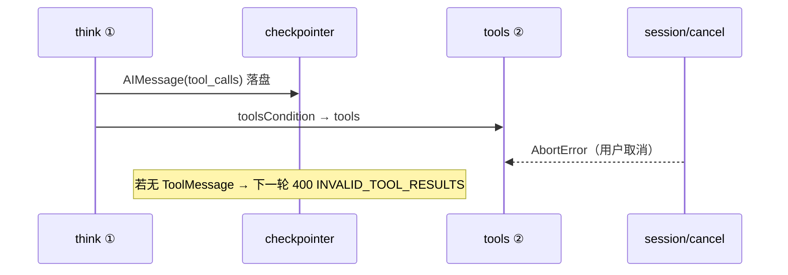

# ReAct 两阶段分工：think（bindTools）与 tools（ToolNode）

> **受众**：Monorepo 维护者、改默认图或 `dev-agent-flow` 提示词时需理解此契约。  
> **关联源码**：[`src/app/graph.ts`](../../../../packages/deepagents-flow-ts/src/app/graph.ts)、[`src/app/nodes/think.ts`](../../../../packages/deepagents-flow-ts/src/app/nodes/think.ts)、[`src/libs/nodes/tools.ts`](../../../../packages/deepagents-flow-ts/src/libs/nodes/tools.ts)  
> **使用者速查**：包内 [flow-orchestration.md](../../../../packages/deepagents-flow-ts/docs/flow-orchestration.md)

默认 Flow 图是**显式 LangGraph ReAct**（不用 `createReactAgent` 黑盒）。其中最容易被误解的一点是：`think` 已经 `bindTools`，为什么还要单独的 `tools` 节点？

**结论**：`bindTools` 只负责让模型**决策**是否调工具、调哪个；**执行**工具并在 state 里写回 `ToolMessage` 是 `tools` 节点的职责。这是 ReAct 协议本身的两步，也是 LangGraph 官方推荐的可组合写法。

---

## 1. 图拓扑（契约）

```
START → prepare → think(model.bindTools) ──(toolsCondition)──┐
                    ▲                                      ├─ 有 tool_calls → tools(ToolNode) → think
                    └──────────────────────────────────────┘
                                         └─ 无 tool_calls → respond(流式) → END
```

对应连线（[`graph.ts`](../../../../packages/deepagents-flow-ts/src/app/graph.ts)）：

- `prepare` → `think`
- `think` → 条件边 `toolsCondition`：`tools` 或 `respond`
- `tools` → `think`（可循环多轮工具）
- `respond` → `END`

---

## 2. 两阶段各自做什么

| 阶段 | 节点 | 输入 | 输出 | 是否执行副作用 |
| --- | --- | --- | --- | --- |
| **① 决策** | `think` | `state.messages` + systemPrompt | `AIMessage`（可有 `tool_calls`） | 否（只调 LLM API） |
| **② 执行** | `tools` | 上一条 `AIMessage.tool_calls` | `ToolMessage[]` | 是（bash / 文件 / MCP / load_skill / task 等） |

### ① think：`bindTools` = 把工具 schema 交给模型

[`think.ts`](../../../../packages/deepagents-flow-ts/src/app/nodes/think.ts) 在工厂创建时解析模型并绑定工具集：

```ts
boundModel = model.bindTools(allTools);
```

节点运行时 `invoke` 模型，返回的 `AIMessage` 可能包含结构化 `tool_calls`（工具名 + 参数 JSON）。  
**模型不会在这里真正执行 `read_file` 或 MCP 调用**——它只是按 function-calling 协议「声明意图」。

无凭证时走 fallback：回显输入、不产生 `tool_calls`，保证图可冒烟。

### ② tools：`ToolNode` = 按 `tool_calls` 真正执行

[`createToolExecNode`](../../../../packages/deepagents-flow-ts/src/libs/nodes/tools.ts) 包装 LangGraph prebuilt `ToolNode`：

1. 读 `state.messages` 最后一条 `AIMessage` 的 `tool_calls`
2. （可选）`onPermissionRequest` 审批门控
3. `toolNode.invoke` 执行每个 call
4. 写回 `ToolMessage[]` 到 state（默认图还更新 `steps`）
5. `onToolCall` 三态透出给 ACP/CLI

---

## 3. 消息流（一轮工具使用的完整协议）

ReAct 在 LangChain 消息模型里是固定序列：

```
HumanMessage
  → AIMessage（含 tool_calls）
  → ToolMessage（工具结果）
  → AIMessage（模型基于结果继续推理或给出最终答案）
```

若把「执行」塞进 `think` 节点：

- 违反「图节点 = 单一职责」的契约
- 无法在图上用 `toolsCondition` 做条件路由
- checkpoint / 流式观测 / 工具审批难以插在「决策」与「执行」之间

因此 **`allTools` 传两次不是重复**：

| 传给谁 | 用途 |
| --- | --- |
| `think`（bindTools） | 工具 **schema**，供模型选型与填参 |
| `tools`（ToolNode） | 工具 **可执行实例**（`StructuredTool.invoke`） |

---

## 4. 路由：`toolsCondition`

[`graph.ts`](../../../../packages/deepagents-flow-ts/src/app/graph.ts) 使用 LangGraph prebuilt：

```ts
.addConditionalEdges("think", toolsCondition, {
  tools: "tools",
  [END]: "respond",
});
```

- 最后一条消息有 `tool_calls` → 走 `tools`
- 没有 → 走 `respond`（流式最终回答给用户）

多轮工具循环：`think → tools → think → tools → … → think → respond`。

---

## 5. 为何 surface 能力挂在 tools 而非 think

`think` 只关心 LLM；以下能力属于「工具执行侧」，放在 `createToolExecNode`：

| 能力 | 位置 | 说明 |
| --- | --- | --- |
| `onToolCall` 三态 | `tools.ts` | ACP `tool_call` / `tool_call_update` 出站 |
| `onPermissionRequest` | `tools.ts` | 工具审批门控（reject/cancel 预合成 error ToolMessage） |
| `normalizeToolResult` | `tools.ts` | MCP `structuredContent` → ACP `rawOutput` |
| 流式最终回答 | `respond` 节点 | 无 `tool_calls` 时才流式给用户 |

详见 [acp/permission.md](./acp/permission.md)、[acp/field-mapping.md](./acp/field-mapping.md)。

---

## 6. `allTools` 里都有什么

[`createFlowTools`](../../../../packages/deepagents-flow-ts/src/app/flow-tools.ts) 组装后注入 `think` 与 `tools`：

- 内置：bash、fs、search、http、json、demo
- **MCP**：`ctx.mcpTools`（session 级 `MultiServerMCPClient.getTools()`）
- **Skill**：`load_skill`（渐进式读 `SKILL.md`）
- **Subagent**：`task`（委派子 ReAct 图；子图内**不含** `task`，防递归）

上述工具在 ReAct 循环里路径相同：`think` 决策 → `tools` 执行。

---

## 7. Subagent（task）与默认图的关系

[`task.tool.ts`](../../../../packages/deepagents-flow-ts/src/app/task.tool.ts) 被主 agent 的 `tools` 节点调用时，内部再 `createFlowGraph` 跑一张**子 ReAct 图**（同样是 `think ↔ tools`）。

区别：

| 维度 | 主 agent | subagent（task） |
| --- | --- | --- |
| 图实例 | session 级 executor | 每次 task 临时创建 |
| checkpointer | 父会话 `FileCheckpointSaver` | 默认 `MemorySaver`，不落父会话 |
| MCP 连接 | session 级 hydrate | **复用**父 runtime 的 `mcpTools` |
| 历史 | 多轮对话累积 | 仅 `description` 单轮输入 |

子图结束 ≠ MCP 关闭；MCP 生命周期见 [runtime-capabilities-lifecycle.md](./runtime-capabilities-lifecycle.md)。

---

## 8. Cancel 与 checkpoint 完整性（think ↔ tools 窗口）

ReAct 两阶段在 **① think 已写出 `tool_calls`、② tools 尚未完成** 时存在脆弱窗口：



**v1.9.4 三层防御**（详 [checkpoint-integrity-and-prompt-resolution.md](./checkpoint-integrity-and-prompt-resolution.md)）：

| 层 | 位置 | 作用 |
| --- | --- | --- |
| 1 | ACP `server.ts` cancel | `repairCheckpoint` 补 synthetic `ToolMessage` 并写回 |
| 2 | `stateful-flow.ts` `run` 入口 | `applyCheckpointMessageRepair` 读盘修复 |
| 3 | `think.ts` 调 LLM 前 | `sanitizeToolCalls` 内存剥离孤立 `tool_calls`（不替代 1/2） |

ACP `failInflightToolsOnCancel` 只更新 **UI** `tool_call_update`（failed）；磁盘 checkpoint 须走层 1/2。

---

## 9. 与 factory / 其他拓扑

- 其他 flow（RAG、travel、HITL 等）在各自 `graph.ts` 里组合节点；凡 ReAct 段仍遵循同一分工。
- `createToolExecNode` 是默认 `tools` 节点的泛化 factory；[`node-kit.md`](../../../../packages/deepagents-flow-ts/docs/node-kit.md) 有 API 说明。
- 主动 MCP 检索（不经 ToolNode）走 [`createMcpRetrievalNode`](../../../../packages/deepagents-flow-ts/src/libs/nodes/mcp-retrieval.ts) + `mcp-access`，与 agent 主 ReAct 链路并列，见 [acp/dataflow-nuwaclaw.md](./acp/dataflow-nuwaclaw.md)。

---

## 10. 常见误解

| 误解 | 事实 |
| --- | --- |
| bindTools 会执行工具 | 只影响模型请求体里的 tools 定义；执行在 `ToolNode` |
| 可以合并 think+tools 成一个节点 | 能写，但失去条件路由、审批插入点、拓扑反射清晰度 |
| subagent 会单独起 MCP | 否；共用父 session 的 `mcpTools` |
| `respond` 也 bindTools | 否；最终回答节点只流式输出，不再绑工具 |

---

## 11. 维护时注意

1. 改默认图连线 → 同步 `graph.ts` 顶注释、`README.md` 默认图小节、`pnpm graph` 反射结果。
2. 新增需在 ReAct 环里执行的能力 → 加入 `createFlowTools` / `allTools`，**不要**在 `think` 里手搓工具调用。
3. 工具审批、ACP 出站 → 改 `tools.ts` / `emit-tool-call.ts`，并更新 `acp/` 文档。
4. **改 think 前 sanitize 或 cancel 写回** → `libs/messages/*`、`stateful-flow.ts`、`server.ts` + [checkpoint-integrity-and-prompt-resolution.md](./checkpoint-integrity-and-prompt-resolution.md)。

---

## 相关文档

- [development/README.md](./README.md) — 开发文档总索引
- [runtime-capabilities-lifecycle.md](./runtime-capabilities-lifecycle.md) — MCP / Skill / Subagent 加载·运行·停止
- [langgraph-native-convergence.md](./langgraph-native-convergence.md) — surface 流式向 LangGraph 原生 chunk 收敛（阶段二）
- [acp/dataflow-nuwaclaw.md](./acp/dataflow-nuwaclaw.md) — MCP 进 bindTools → ToolNode 的全栈数据流
- [checkpoint-integrity-and-prompt-resolution.md](./checkpoint-integrity-and-prompt-resolution.md) — cancel / checkpoint 修复与 think 层 sanitize
