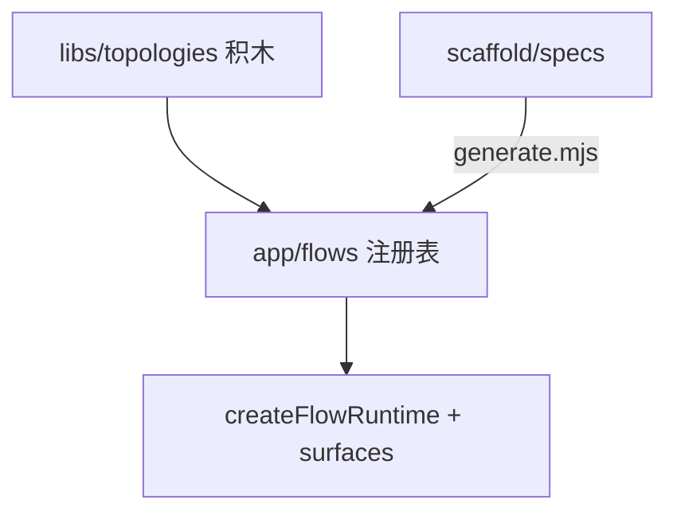

# deepagents-flow-ts 近期开发与优化梳理

> **状态**：✅ 现行维护记录（随版本迭代更新本页）  
> **当前包版本**：`1.14.0`（权威源：`packages/deepagents-flow-ts/package.json`）  
> **受众**：Monorepo 维护者、code-review、发布前核对  
> **使用者文档**：见包内 [README.md](../../../../packages/deepagents-flow-ts/README.md)

本文按版本与主题汇总 **2026-06 ~ 2026-07** 在 `packages/deepagents-flow-ts` 上的功能需求落地与问题优化。  
**已废弃的路径、命令、文档口径在文中用 ⚠️ 标出**，避免与现行实现混淆。

---

## 1. 现行架构口径（v1.14.0）

| 概念 | 现行位置 | 说明 |
| --- | --- | --- |
| 图逻辑 SSOT | `src/libs/topologies/` | recipe / graph / nodes，零 surface 依赖 |
| 可运行 flow 挂载 | `src/app/flows/` | 注册表 + 内置 flow + scaffold 生成薄封装 |
| 场景示范 | `scripts/scaffold/specs/_example.*.flow.json` | 替代已删除的 `examples/` |
| 拓扑反射 | `src/libs/topologies/reflect.ts` | 默认图经 `app/topology.ts` 复用 |
| 内置 `dev-agent` | `src/app/flows/dev-agent/` | `stateful-custom`，注册名 `dev-agent` |
| 平台工具 schema | `spec.tools` → runtime `platform-tools/` | 见 [platform-tool-schema-driven-runtime.md](./platform-tool-schema-driven-runtime.md) |



---

## 2. 版本变更摘要

### v1.14.0 — 拓扑分层简化（2026-07）

**需求**：消除 `libs/topologies`、`examples/`、`app/topologies` 三层重复教学面与挂载歧义。

| 变更 | 说明 |
| --- | --- |
| 删除 `examples/` | ⚠️ 不再提供 `pnpm example`、`typecheck:examples`、`example-registry` |
| `dev-agent` 迁入 `app/flows/dev-agent/` | ⚠️ 废弃 `src/app/topologies/dev-agent.ts` |
| 测试迁址 | `examples/*/tests` → `tests/topologies/`（直连 libs + `materializeRecipe`） |
| 统一反射 | `getFlowTopology()` 调用 `reflectTopology()` |
| scaffold 保留名 | `default` / `dev-agent` 禁止 scaffold 覆盖（`generate.mjs`） |
| 注册表 | 内置 `dev-agent` 为 `stateful-custom`；新增 `tests/flow-registry.test.ts` |
| CI | ⚠️ `typecheck:examples` 改为 `typecheck` |
| 文档 | 包 README、`dev-agent-flow` system-prompt / flow-builder、development 断链修复 |

**现行验证命令**：

```bash
pnpm typecheck && pnpm test
pnpm smoke -- --entry src/index.ts   # 读 config.activeFlow
node scripts/scaffold/generate.mjs scripts/scaffold/specs/_example.coding-agent.flow.json
```

**相关 commit**：`01072bec`（refactor）、`319496db`（清理误提交 zip）

---

### v1.11.0 – v1.13.0 — 平台工具 schema-driven runtime

**需求**：平台登记的工具在运行期可重复、可测试、可追踪；禁止手写 fetch 包装已登记能力。

| 版本 | 要点 |
| --- | --- |
| v1.11.0 | `spec.tools` 作为 schema **唯一来源**；`src/runtime/platform-tools/*` 构建 `StructuredTool` 注入 `allTools` |
| v1.12.x | scaffold `platformToolRefs` 透传；flow 注册表项带 `platformToolRefs` |
| v1.13.0 | 描述 fallback、配置对齐 |

**现行文档**：[platform-tool-schema-driven-runtime.md](./platform-tool-schema-driven-runtime.md)  
**⚠️ 过时文档**：[platform-tool-binding-design.md](./platform-tool-binding-design.md)（「运行时不读 spec.tools」旧口径）

**问题优化**：

- `f75e29a4`：平台工具重复 `onToolCall` 事件 — `callbacks` 选项抑制重复透出
- `b24c7672`：`description` 空时 fallback 到 `name`

---

### v1.9.0 – v1.9.4 — Subagent、HITL、Checkpoint 稳定性

**需求**：默认 ReAct 支持子智能体委派、ACP Plan、并行流式；修复线上 checkpoint 400 与 systemPrompt 覆盖。

| 主题 | 版本 | 文档 |
| --- | --- | --- |
| `write_todos` + `task` 子 agent | v1.9.0–1.9.1 | [subagent-task-and-acp-plan.md](./subagent-task-and-acp-plan.md) |
| 内置 ask-question MCP + `present_review` | v1.8+ | [ask-question-mcp-hitl.md](./ask-question-mcp-hitl.md) |
| ACP systemPrompt **追加**而非覆盖 | v1.9.2 | [checkpoint-integrity-and-prompt-resolution.md](./checkpoint-integrity-and-prompt-resolution.md) |
| cancel 后孤立 `tool_calls` 修复 | v1.9.3–1.9.4 | 同上 |
| `dev-agent` 注入 `onPlan` | v1.9.x | subagent 文档 § dev-agent callbacks |

**问题优化**：

- 并行 `task` 流式 messageId 分桶
- 子 agent 无输出时的多级兜底
- `AcpPlanCoordinator` 合并并行 Plan
- 重复 subagent token 投递修复

---

### v1.10.0 — 包名与平台工具绑定基座

- npm 包名 **`nuwax-flow-ts`**（bin：`nuwax-flow-ts`）
- 平台工具绑定基础设施（后续 v1.11 演进为 schema-driven）

---

### 更早 — 拓扑积木化 + scaffold（✅ 已落地）

| 项 | 状态 | 文档 |
| --- | --- | --- |
| `libs/topologies/*` 八积木 SSOT | ✅ 现行 | 包 README 拓扑表 |
| scaffold `generate.mjs` + zod spec | ✅ 现行 | `scripts/scaffold/schema.mjs` |
| `feat/topology-scaffold` 15 项修复 | ✅ 已完成 | [topology-scaffold-review-fixes-plan.md](./topology-scaffold-review-fixes-plan.md) |
| custom 拓扑默认 `conversational`（HITL 除外） | ✅ v1.13+ | `b2e81896` |

**⚠️ 该计划文档内**仍提及 `typecheck:examples`、`examples/` 路径 —— 仅作历史执行记录，**现行以 v1.14.0 口径为准**。

---

## 3. ⚠️ 已废弃清单（勿再引用）

### 目录 / 路径

| 已废弃 | 替代 |
| --- | --- |
| `packages/deepagents-flow-ts/examples/` | `scripts/scaffold/specs/` + `tests/topologies/` |
| `src/app/topologies/dev-agent.ts` | `src/app/flows/dev-agent/index.ts` |
| `scripts/lib/example-registry.mjs` | 已删除 |
| `scripts/run-example.mjs` | `pnpm flow` / `pnpm smoke --entry` |
| `tsconfig.examples.json` | 已删除，统一 `pnpm typecheck` |

### 命令 / CI

| 已废弃 | 替代 |
| --- | --- |
| `pnpm example <name>` | scaffold → `activeFlow` → `pnpm flow` |
| `pnpm smoke -- --example <name>` | `pnpm smoke`（读 `activeFlow`）或 `--entry` |
| `pnpm typecheck:examples` | `pnpm typecheck` |
| CI `typecheck:examples` 步骤 | CI `typecheck`（`.github/workflows/ci.yml`） |

### 文档 / 概念

| 已废弃口径 | 现行 |
| --- | --- |
| 「`examples/` 只读参考 / 精选范例」 | 「`scaffold/specs` 示范 + `libs/topologies` SSOT」 |
| 「dev-agent 在 `app/topologies/`」 | 「dev-agent 在 `app/flows/dev-agent/`」 |
| 「re-export shim 在 examples」 | 已删除；直接 import `libs/topologies` |
| `spec.tools` 仅开发期记录、运行时不读 | ⚠️ 见 [platform-tool-binding-design.md](./platform-tool-binding-design.md) |
| RAG 内置于 app-ts 早期方案 | ⚠️ 见 [rag-agent-plan.md](./rag-agent-plan.md) → 现状 `libs/topologies/rag/` |

### scaffold 约束（v1.14+ 新增）

- **禁止** `spec.name` 为 `default` 或 `dev-agent`（会覆盖内置 SSOT）
- `topology: "dev-agent"` 时 `name` 应使用其它 kebab-case（如 `coding-agent`）

---

## 4. 现行内置 flow 注册表

`src/app/flows/index.ts`（`activeFlow` 选图）：

| name | kind | 形态 |
| --- | --- | --- |
| `default` | stateful-recipe | conversational ReAct |
| `dev-agent` | stateful-custom | ReAct + 手写 run-loop + 压缩 |
| `search-aggregator` | stateful-recipe | 零图 + 平台能力样板 |
| `translate-review` | stateful-recipe | custom 流式管道教学 |
| `router-gate` | stateful-recipe | LLM 路由教学 |

更多 preset 通过 scaffold 从 `libs/topologies` 生成并注册。

---

## 5. 计划中（未落地）

| 主题 | 文档 | 状态 |
| --- | --- | --- |
| LangGraph 原生收敛（streamMode、retryPolicy、MessagesAnnotation） | [langgraph-native-convergence.md](./langgraph-native-convergence.md) | 📋 计划中 |

该计划文内大量引用 ⚠️ `examples/` 路径与 `typecheck:examples` —— **阅读时按 §3 废弃清单换算**。

---

## 6. 维护者核对清单（发布前）

- [ ] `package.json` version 与 `pnpm version:check` 一致
- [ ] `pnpm typecheck && pnpm test` 绿
- [ ] 无新增对 ⚠️ `examples/`、`app/topologies`、`pnpm example` 的现役文档引用
- [ ] scaffold 新 flow 未使用保留名 `default` / `dev-agent`
- [ ] 平台能力改动已同步 [platform-tool-schema-driven-runtime.md](./platform-tool-schema-driven-runtime.md)
- [ ] ACP 改动已同步 `acp/` 子目录

---

## 7. 相关文档索引

| 主题 | 文档 | 状态 |
| --- | --- | --- |
| 本页（近期变更总览） | **recent-changelog.md** | ✅ 现行 |
| 平台工具 runtime | [platform-tool-schema-driven-runtime.md](./platform-tool-schema-driven-runtime.md) | ✅ 现行 |
| 平台工具旧设计 | [platform-tool-binding-design.md](./platform-tool-binding-design.md) | ⚠️ 过时 |
| Checkpoint / systemPrompt | [checkpoint-integrity-and-prompt-resolution.md](./checkpoint-integrity-and-prompt-resolution.md) | ✅ 现行 |
| Subagent / Plan | [subagent-task-and-acp-plan.md](./subagent-task-and-acp-plan.md) | ✅ 现行 |
| HITL / ask-question | [ask-question-mcp-hitl.md](./ask-question-mcp-hitl.md) | ✅ 现行 |
| 拓扑 scaffold 修复计划 | [topology-scaffold-review-fixes-plan.md](./topology-scaffold-review-fixes-plan.md) | ✅ 已完成（文内部分路径 ⚠️ 过时） |
| RAG 早期计划 | [rag-agent-plan.md](./rag-agent-plan.md) | ⚠️ 过时 |
| LangGraph 收敛 | [langgraph-native-convergence.md](./langgraph-native-convergence.md) | 📋 计划中 |
| 开发文档总索引 | [README.md](./README.md) | ✅ 现行 |
