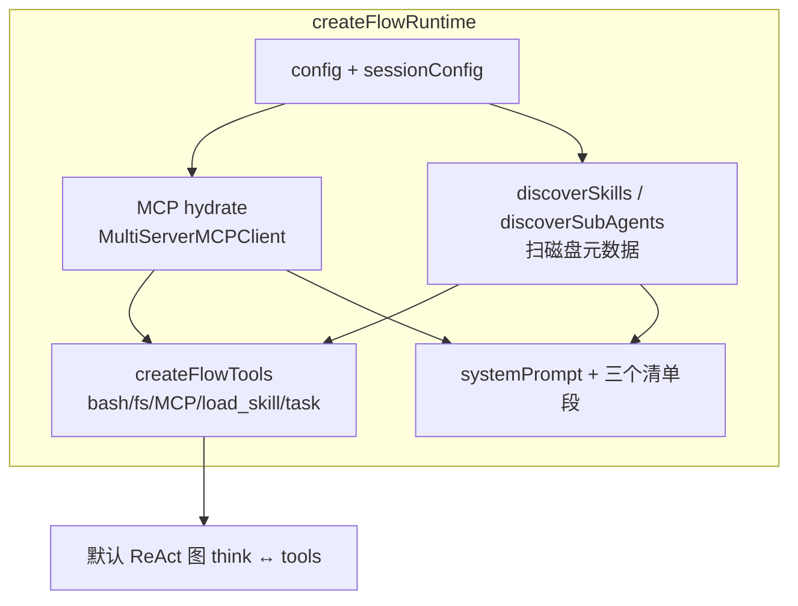
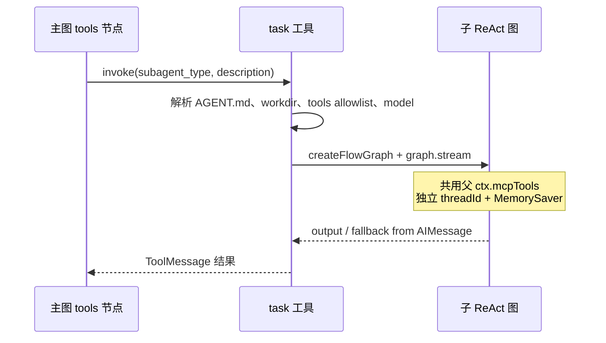
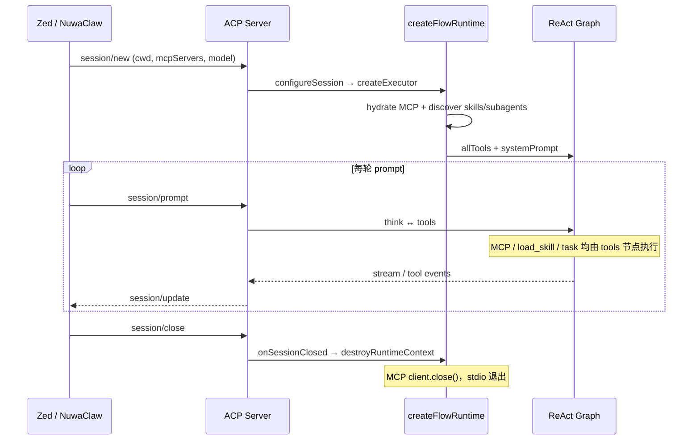

# 运行时能力生命周期：MCP、Skill、Subagent

> **受众**：Monorepo 维护者；改 runtime 装配、ACP session、能力发现或 `createFlowTools` 时必读。  
> **关联源码**：[`src/index.ts`](../../../../packages/deepagents-flow-ts/src/index.ts)（`createFlowRuntime`）、[`src/runtime/context/runtime-context.ts`](../../../../packages/deepagents-flow-ts/src/runtime/context/runtime-context.ts)、[`src/runtime/context/discovery.ts`](../../../../packages/deepagents-flow-ts/src/runtime/context/discovery.ts)、[`src/app/flow-tools.ts`](../../../../packages/deepagents-flow-ts/src/app/flow-tools.ts)、[`src/app/task.tool.ts`](../../../../packages/deepagents-flow-ts/src/app/task.tool.ts)  
> **相关**：[react-two-phase.md](./react-two-phase.md)（三者如何进 ReAct 的 `think`/`tools`）、[acp/dataflow-nuwaclaw.md](./acp/dataflow-nuwaclaw.md)（MCP 全栈数据流）、包内 [capabilities.md](../../../../packages/deepagents-flow-ts/docs/capabilities.md)（能力分层契约）

本文说明 **MCP、Skill、Subagent** 在 `deepagents-flow-ts` 里各自的 **加载 → 运行 → 停止** 时机与资源边界。三者都在 `createFlowRuntime` 装配，但生命周期差别很大。

---

## 0. 总览：装配入口

每次创建 Flow runtime（ACP 下通常 **每个 session 一次**）走同一条装配链：

```ts
// src/index.ts — createFlowRuntime
const ctx = await createRuntimeContextAsync(appConfig, { sessionConfig, workspaceRoot });
const skills = discoverSkills(appConfig, workspaceRoot);
const subAgents = discoverSubAgents(appConfig, workspaceRoot);
const allTools = createFlowTools(ctx, { workspaceRoot, policy, skills, subAgents });
// systemPrompt += MCP 清单 + Skills 清单 + Subagents 清单
```



| 能力 | 本质 | 加载时机 | 运行触发 | 停止时机 |
| --- | --- | --- | --- | --- |
| **MCP** | 外部 server（stdio 子进程 / HTTP / SSE） | session 启动 `hydrate` | 模型调 `server__tool`（tools 节点） | session close → `destroyRuntimeContext` |
| **Skill** | 本地 `SKILL.md` 文件 | session 启动扫目录 | 模型调 `load_skill` | 无需停止（无进程） |
| **Subagent** | 内存里另一张 ReAct 图 | session 启动扫 `AGENT.md` | 模型调 `task` | `task` 返回即结束 |

---

## 1. MCP

### 1.1 配置从哪来

合并优先级（**session-wins**）：

1. `config/flow-agent.config.json` → `mcp.configPath`（默认 `./config/mcp.default.json`，**内置 `ask-question` fallback**）
2. 配置内联 `mcp.servers`
3. ACP `session/new`（或 `session/load`）下发的 `params.mcpServers`（**同名 session-wins 覆盖内置**）

详见 [ask-question-mcp-hitl.md](./ask-question-mcp-hitl.md)。

```json
// config/flow-agent.config.json（节选）
"mcp": {
  "configPath": "./config/mcp.default.json",
  "mergeStrategy": "session-wins"
}
```

平台 MCP **经 ACP 宿主下发**，运行时不主动向平台拉取。

### 1.2 加载（何时）

| 步骤 | 函数 | 说明 |
| --- | --- | --- |
| 同步建壳 | `createRuntimeContext` | 合并 server 配置；`mcpTools` 仍为空 |
| 异步 hydrate | `hydrateRuntimeContext` | `MultiServerMCPClient.getTools()` → `ctx.mcpTools` |
| 容错 | bulk 失败 → per-server 重试 | 单个坏 server 不拖垮全部 |
| 验证 | `verifyMcpServersWithToolList` | 写入 `mcpServerToolLists` 供 system prompt |

传输类型（`toConnections`）：

| 类型 | 行为 |
| --- | --- |
| **stdio** | spawn 子进程；默认 **restart**（长驻 server 崩溃自愈） |
| **http** | Streamable HTTP；失败可 `automaticSSEFallback` |
| **sse** | 长连接；默认 **reconnect** |

工具名带 **`<server>__<tool>`** 前缀（`prefixToolNameWithServerName`），便于模型识别来源。

### 1.3 运行（怎么用）

**主路径（默认 ReAct 图）**——与 bash/fs 相同：

```
think（bindTools 含 mcpTools）
  → AIMessage.tool_calls
  → tools 节点（ToolNode）
  → ToolMessage
  → think 继续
```

见 [react-two-phase.md](./react-two-phase.md)。

**补充路径（拓扑内主动检索）**——不经 ToolNode：

- RAG `retrieve`、travel `research` 等节点用 `createMcpRetrievalNode` + `mcp-access`
- **优先复用** session 级 `ctx.mcpClient`（同一连接，尤其 chrome-devtools 等有状态 server）
- 无注入 client 时 **临时** `MultiServerMCPClient`，节点结束 `dispose()`

```
Agent 主路径：getTools() → bindTools → ToolNode（session 级长连接）
图内检索：    mcpClient.getClient(server).callTool() 或临时 client
```

### 1.4 停止（何时）

| 场景 | 动作 |
| --- | --- |
| **ACP `session/close`** | `onSessionClosed` → `dispose()` → `destroyRuntimeContext()` → `mcpClient.close()` |
| **ACP `configureSession` 重配** | 先 dispose 旧 runtime，再建新（防 stdio 泄漏） |
| **CLI `flow` 单次** | `runFlowCli` 结束后 `destroyRuntimeContext` |
| **图内一次 tool call** | **不关** MCP；连接整个 session 复用 |
| **subagent `task` 结束** | **不关** MCP；子图复用父 `mcpTools` |

```ts
// src/index.ts — ACP per-session 工厂
dispose: async () => {
  await destroyRuntimeContext(runtime.ctx).catch(() => {});
},
```

```ts
// src/surfaces/acp/server.ts — onSessionClosed
await entry.dispose?.();
```

**MCP 是唯一需要显式 teardown 的长生命周期资源**（stdio 子进程 / HTTP 连接）。

---

## 2. Skill

### 2.1 发现路径（何时加载元数据）

配置（当前模板默认值）：

```json
"skills": { "directories": [], "progressiveLoading": true },
"agentsDirectories": ["./builtin", "./.agents"]
```

`resolveSkillsPaths` 扫描：

1. `config.skills.directories`（默认可为空）
2. 每个 `agentsDirectories` 下的 `<dir>/skills/<name>/SKILL.md`
   - 例：`builtin/skills/<name>/SKILL.md`
   - 例：`.agents/skills/<name>/SKILL.md`（平台下载，开发 Agent 不写）

`discoverSkills`：**只解析 frontmatter**（`name`、`description`），**不读正文**。同名按扫描顺序，先出现者优先。

### 2.2 运行（怎么用）

默认 `progressiveLoading: true`（渐进式披露）：

| 层 | 内容 |
| --- | --- |
| **system prompt** | `renderSkillsSection`：只列 name + description，提示先调 `load_skill` |
| **工具** | `createSkillTool` → 工具名 `load_skill` |
| **执行** | 模型调 `load_skill(name)` → `readFileSync(SKILL.md)` 全文 + skillRoot 路径元信息 |

若 `progressiveLoading: false`：

- 启动时把全部 SKILL **正文**塞进 system prompt
- **不注册** `load_skill` 工具（`createFlowTools` 仅在 progressive 时传入 skills）

在 ReAct 环中的路径：

```
think 决策 → tools 执行 load_skill → ToolMessage(全文) → think 按 skill 执行后续 bash/MCP 等
```

Skill 附带的 `./scripts/*.sh` 无独立进程；由后续 `bash` 工具在 skillRoot 下执行。

### 2.3 停止

- **无子进程、无连接**；无需 `dispose`
- 每次 `load_skill` 是一次磁盘读
- session 结束无额外清理

### 2.4 与 builtin / `.agents` 的分工

| 来源 | 路径 | 谁维护 |
| --- | --- | --- |
| 模板内置 | `builtin/skills/` | 模板仓库 |
| 平台 | `.agents/skills/` | 平台 UI / download；开发 Agent **禁止**手写 |

详见包内 [capabilities.md](../../../../packages/deepagents-flow-ts/docs/capabilities.md)。

---

## 3. Subagent

### 3.1 发现路径（何时加载元数据）

```json
"subagents": { "directories": [] },
"agentsDirectories": ["./builtin", "./.agents"]
```

`resolveSubagentPaths` 扫描：

1. `config.subagents.directories`（flat：`<dir>/<name>/AGENT.md`，默认空）
2. 每个 `agentsDirectories` 下 `<dir>/agents/<name>/AGENT.md`
   - 例：`builtin/agents/researcher/AGENT.md`
   - 例：`.agents/agents/...`（平台编排）

解析 `AGENT.md`：

| 字段 | 用途 |
| --- | --- |
| frontmatter `name` / `description` | 清单与 `task` 路由 |
| **body** | 子 agent 的 `systemPrompt` |
| `model` | 可选覆盖（`model-name` 或 `provider/model`） |
| `tools` | 可选 allowlist（逗号/空白分隔） |
| `workdir` | 可选相对工作目录（沙箱 cwd） |

**同名**：按 `resolveSubagentPaths` 顺序，**builtin 优先于 `.agents`**。

### 3.2 运行（怎么用）

主 agent 通过 **`task` 工具**委派（仅主 agent 的 `allTools` 含 `task`；子 agent **不含**，防递归）。

每次 `task({ subagent_type, description })`：



| 维度 | 主 agent | subagent（task） |
| --- | --- | --- |
| 图 | session 级 executor | 每次 task **临时** `createFlowGraph` |
| checkpointer | 父 `FileCheckpointSaver` | 默认 **MemorySaver**，不进父会话 |
| threadId | 稳定 session thread | `subagent-<name>-<uuid>` |
| 历史 | 多轮对话 | **仅** `description`，看不到主对话 |
| MCP | session hydrate | **复用**父 `ctx.mcpTools`（同一连接）；可直接调已授权搜索 MCP |
| 工具集 | 含 `task`、`write_todos` | `buildTools(subRoot)` **不含** `task`；含 `write_todos` 等 reused 工具 |
| 流式 | surface 主路径 | `onToken(text, name, toolCallId)`；ACP `messageId=subagent:<name>:<id>` |
| Plan | `write_todos` → `onPlan` | `wrapPlan` 带 `source` + 父 `toolCallId`；ACP 侧 `AcpPlanCoordinator` 合并 |
| 返回值 | `output` | `extractSubagentTaskOutput`（output → AIMessage → streamBuffer） |
| 取消 | ACP signal | 父 `signal` 透传 `graph.stream` |
| 审批 | `onPermissionRequest` | 透传父级（子图内 bash 等仍走审批门控） |

**并行多 `task`**：同一轮可并行委派；流式与 Plan 按父 `tool_calls[].id` 分桶，不再要求串行 `task`。详表见 [subagent-task-and-acp-plan.md](./subagent-task-and-acp-plan.md)。

子图内部仍是 **think ↔ tools** ReAct，见 [react-two-phase.md §7](./react-two-phase.md#7-subagenttask与默认图的关系)。

### 3.3 停止

| 资源 | 行为 |
| --- | --- |
| 子图 | `task` 返回即结束；`finally` 发 `onStage`「subagent 完成」 |
| MCP | **不关闭** |
| checkpointer | 内存态，随子图结束丢弃 |
| 子进程 | 仅子图内 bash 等命令的生命周期，无 session 级 teardown |

---

## 4. ACP 模式完整时间线



**CLI 单次 `flow`**：一个进程内 `createFlowRuntime` → 跑完 → `destroyRuntimeContext`，无 per-session Map。

---

## 5. system prompt 解析与清单段

### 5.1 Base prompt（身份层）

[`resolveSystemPrompt`](../../../../packages/deepagents-flow-ts/src/runtime/context/prompt.ts)（经 `createFlowRuntime`）决定 **base** 文本：

| 条件 | 结果 |
| --- | --- |
| ACP `sessionConfig.systemPrompt` 有值（v1.9.2+） | `flow.base.md`（或 `systemPromptPath`）+ session 补充 + `PLATFORM_CONVENTIONS` |
| 无 session | `config.agent.systemPrompt` > `systemPromptPath` 文件 > inline fallback |

ACP 侧如何把 params 归一为 `sessionConfig.systemPrompt` → [acp/dataflow-nuwaclaw.md §会话配置](./acp/dataflow-nuwaclaw.md#会话配置sessionnewload--per-session-runtime)。**勿**把 session 提示词当作完整替换本地身份（v1.9.2 前曾导致线上 Agent 人设丢失）。

### 5.2 运行时清单三段

`createFlowRuntime` 在 base prompt 后追加（有内容才拼）：

| 函数 | 内容 |
| --- | --- |
| `renderMcpServersSection` | tools/list 验证成功的 server + 工具短名 |
| `renderSkillsSection` | skill 名 + 描述（或 progressive=false 时全文） |
| `renderSubagentsSection` | subagent 名 + 描述 + 提示用 `task` 委派 |

静态查询（不 hydrate MCP）：`pnpm exec tsx src/index.ts capabilities`。

---

## 6. 维护时注意

1. **改 MCP 合并/关闭逻辑** → 同步 `runtime-context.ts`、`acp/server.ts` dispose 链、[acp/dataflow-nuwaclaw.md](./acp/dataflow-nuwaclaw.md)。
2. **改发现路径** → `discovery.ts` + `config/flow-agent.config.json` + 包内 `capabilities.md` + `dev-agent-flow` 规则。
3. **subagent 不要单独 hydrate MCP**；应继续复用父 `ctx.mcpTools`，否则 stdio 子进程翻倍且 dispose 边界混乱。
4. **改 subagent 流式 / plan / write_todos** → [subagent-task-and-acp-plan.md](./subagent-task-and-acp-plan.md)。
5. **改 systemPrompt 优先级 / ACP 追加语义** → `prompt.ts`、`session-config.ts`、[checkpoint-integrity-and-prompt-resolution.md](./checkpoint-integrity-and-prompt-resolution.md)。
6. **checkpoint 孤立 tool_calls / cancel 写回** → `libs/messages/*`、`stateful-flow.ts`、`server.ts` cancel 分支；同上 checkpoint 文档。
7. **Skill 正文过大** → 保持 `progressiveLoading: true`，避免撑爆 system prompt。

---

## 相关文档

- [README.md](./README.md) — 开发文档总索引
- [react-two-phase.md](./react-two-phase.md) — think/tools 两阶段与三者进 ReAct 的方式
- [acp/dataflow-nuwaclaw.md](./acp/dataflow-nuwaclaw.md) — MCP + LangGraph + ACP 数据流
- [subagent-task-and-acp-plan.md](./subagent-task-and-acp-plan.md) — subagent 委派、write_todos、ACP plan
- [checkpoint-integrity-and-prompt-resolution.md](./checkpoint-integrity-and-prompt-resolution.md) — systemPrompt 追加、checkpoint 三层修复
- [acp/permission.md](./acp/permission.md) — tools 节点审批门控（含 MCP 工具调用）
