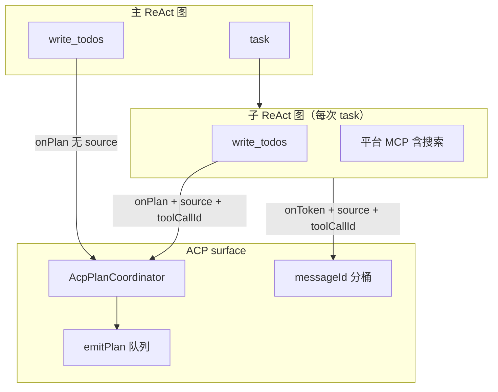

# Subagent 委派增强与 ACP Plan / 并行流式

> **状态**：✅ 现行（`deepagents-flow-ts` **v1.9.1** 功能落地；**v1.9.2–v1.9.4** checkpoint / systemPrompt 见 [checkpoint-integrity-and-prompt-resolution.md](./checkpoint-integrity-and-prompt-resolution.md)）  
> **受众**：Monorepo 维护者；改 `task` 工具、subagent 流式、`write_todos`、ACP `plan` / `messageId` 时必读。  
> **关联源码**：[`task.tool.ts`](../../../../packages/deepagents-flow-ts/src/app/task.tool.ts)、[`todo.tool.ts`](../../../../packages/deepagents-flow-ts/src/libs/tools/todo.tool.ts)、[`plan-coordinator.ts`](../../../../packages/deepagents-flow-ts/src/surfaces/acp/plan-coordinator.ts)、[`server.ts`](../../../../packages/deepagents-flow-ts/src/surfaces/acp/server.ts)（`buildAcpCallbacks`）、[`tools.ts`](../../../../packages/deepagents-flow-ts/src/libs/nodes/tools.ts)（`langgraph_tool_call_id` 透传）  
> **使用者排障**：[troubleshooting.md § task/subagent](../../../../packages/deepagents-flow-ts/docs/troubleshooting.md)、[dev-agent-flow Part 6](../../../../packages/dev-agent-flow/orchestration/skills/flow-builder/references/part6-subagent.md)

本文记录 **2026-07** 一轮 subagent / ACP 能力增强：内置 `write_todos`、并行 `task` 流式分桶、会话级 Plan 合并、子 agent 输出兜底与联网委派约定，以及后续 code-review 修复项。

---

## 1. 背景与目标

| 问题 | 目标 |
| --- | --- |
| 并行多个 `task` 时 subagent 流式预览混在同一 message | ACP `messageId` 按 **subagent 名 + 父 `tool_call_id`** 分桶 |
| 子 agent 末轮仅 `tool_calls`、未到 `respond` 时返回 `(subagent 无输出)` | 多级兜底：`output` → AIMessage 扫描 → stream buffer |
| 主 agent 与子 agent 各自维护 Todo，ACP 只有会话级 `plan` | `AcpPlanCoordinator` 按父 `task` id 合并并行计划 |
| 子 agent 不能联网、须在 `description` 里塞搜索结果 | 默认继承父工具集（含平台聚合 MCP）；框架追加委派后缀 |
| `dev-agent` 手写 run-loop 未注入 `onPlan` | callbacks 双轨对齐 `createStatefulFlow` |

---

## 2. 能力总览



| 能力 | 入口 | ACP 出站 |
| --- | --- | --- |
| **write_todos** | 主 agent / subagent 调工具 | `sessionUpdate: plan`（完整快照） |
| **task 流式** | subagent `graph.stream(messages)` | `agent_message_chunk` + `messageId` |
| **task 返回值** | `extractSubagentTaskOutput` | ToolMessage 文本（非 ACP 专有） |
| **并行 task** | 同轮多条 `tool_calls` | 各自 `messageId` + plan 分桶 |

---

## 3. `write_todos` 内置工具

**位置**：[`src/libs/tools/todo.tool.ts`](../../../../packages/deepagents-flow-ts/src/libs/tools/todo.tool.ts)  
**装配**：[`flow-tools.ts`](../../../../packages/deepagents-flow-ts/src/app/flow-tools.ts) 的 `reused` 数组（与 `http_request` / `json_utils` 同级，主 agent 与子 agent 共享实例）。

### 3.1 语义

- ACP `plan` 是 **完整快照**，不是增量 patch → 模型每次调用须传 **全部** 条目（`todos.min(1).max(100)`）。
- 工具无状态；通过 `ToolRuntime.configurable.onPlan` 触发 `FlowCallbacks.onPlan`。
- `cancelled` 状态映射为 ACP `skipped`；`id` 字段仅供模型整理，**不**进入 `PlanEntry`。

### 3.2 回调注入双路径

`createToolExecNode` 在 invoke 时合并：

```ts
onPlan: config?.configurable?.onPlan ?? callbacks?.onPlan
```

| 路径 | 谁注入 | 场景 |
| --- | --- | --- |
| **运行期 configurable** | `createStatefulFlow` / ACP `flow.run` | 默认 ACP / CLI 有状态 flow |
| **构造期 callbacks** | `createFlowGraph({ callbacks })` | `executeFlow`、单测、子图 `wrapPlan` |

子 agent 额外在 `graph.stream` 的 `configurable.onPlan` 挂 `wrapPlan`（见 §4.3）。

### 3.3 提示词

[`prompts/flow.base.md`](../../../../packages/deepagents-flow-ts/prompts/flow.base.md) 已列入内置工具；复杂多步骤任务才建 Todo，简单任务不要调用。

---

## 4. `task` 工具增强

**位置**：[`src/app/task.tool.ts`](../../../../packages/deepagents-flow-ts/src/app/task.tool.ts)

### 4.1 默认工具集与联网

- 子 agent **默认省略** `AGENT.md tools` → `buildTools(subRoot)` 继承父级工具（含 session hydrate 的 MCP，**不含 `task`**）。
- 框架在 AGENT.md 正文后追加 `subagentDelegationSuffix`：
  - 须给出非空自然语言结论；
  - 可调用当前工具列表中已授权的搜索 MCP；
  - 若工具集含 `write_todos`，提示复杂任务维护 Todo 快照。

**禁止**在 `AGENT.md tools` 写平台登记名（如 `联网搜索_1`）→ 报未知工具。搜索 MCP 运行时名由 `tools/list` 发现。

### 4.2 返回值：`extractSubagentTaskOutput`

优先级（导出函数，单测覆盖）：

1. `state.output.trim()`（`respond` 写入）
2. 倒序扫描 `messages`，跳过非 `ai`、跳过空文本，取 **末条非空** AIMessage
3. `streamBuffer`（`task` 流式循环中累积的 token）

仍为空 → `"(subagent 无输出)"`。

`messageRole` 兼容 LangChain 实例与 checkpoint 反序列化 plain object（`_getType()` / `type`）。

### 4.3 流式与 Plan 透传

每次 `task`：

```text
subagentRunId = randomUUID()
threadId      = subagent-{name}-{subagentRunId}
toolCallId    = resolveTaskToolCallId(runConfig, subagentRunId)
```

`resolveTaskToolCallId` 解析顺序：`toolCallId` / `toolCall.id` → `configurable.langgraph_tool_call_id` → `metadata.tool_call_id` → **完整 `subagentRunId`**（v1.9.1：不再解析 `threadId` 后缀，避免连字符子 agent 名截断 UUID）。

| 回调 | 包装行为 |
| --- | --- |
| `onToken(text, subagent_type, toolCallId)` | 仅 `STREAM_TEXT_NODES` 的 chunk 累积进 `streamBuffer` |
| `onToolCall` | `toolName` 前缀 `[{subagent_type}]` |
| `onPlan` | 附加 `source: subagent_type`、`toolCallId` |
| `onPermissionRequest` | 原样透传父级（v1.9.0+） |

子图 `graph.stream` 显式 `callbacks: []`，避免 token 经父图 messages **重复冒泡**（见 commit `9b9507e6`）。

### 4.4 并行 `task` 的 `tool_call_id`

[`tools.ts`](../../../../packages/deepagents-flow-ts/src/libs/nodes/tools.ts) 在 **单条** tool call 时写入 `configurable.langgraph_tool_call_id`；多条并行时由 LangGraph ToolNode 分叉，各实例从 `ToolRuntime` 读取真实 id（`task-tool.test.ts`「并行 task」用例）。

---

## 5. ACP Plan：`AcpPlanCoordinator`

**位置**：[`src/surfaces/acp/plan-coordinator.ts`](../../../../packages/deepagents-flow-ts/src/surfaces/acp/plan-coordinator.ts)  
**生命周期**：每个 `onPrompt` 在 `buildAcpCallbacks` 内 **新建** 实例 → 单轮 prompt 内合并，轮次间不残留。

### 5.1 合并规则

| `PlanEvent` | 行为 |
| --- | --- |
| 无 `source` | 覆盖 `parentEntries`（主 agent plan） |
| 有 `source` + `toolCallId` | 以 `toolCallId` 为 key 存 subagent 最新 entries |
| 有 `source`、无 `toolCallId` | key 回退 `source:{name}`（并行同名校会撞桶，正常路径应由 `task` 带 id） |
| `entries.length === 0` | 删除对应 subagent 分桶 |

出站前对 subagent 条目加前缀：`[{source}] {content}`。

### 5.2 发送队列（v1.9.1）

[`server.ts`](../../../../packages/deepagents-flow-ts/src/surfaces/acp/server.ts) `onPlan`：

1. `planCoordinator.update(e)` 同步更新内存状态  
2. `planSendQueue.then(() => emitPlan(..., planCoordinator.snapshot()))` — **发送时再 snapshot**，避免并行更新入队后 emit 发出过期快照  
3. 发送失败不阻断后续更新（`planSendQueue = queued.catch(() => undefined)`）

---

## 6. ACP 流式 `messageId`

```text
主 agent：  （无 messageId，默认主消息流）
subagent：  subagent:{safe(name)}:{safe(toolCallId)}
```

`safe` = 将 `:` 与空白替换为 `_`。并行同名校 subagent 靠 **不同父 `tool_call_id`** 区分。

**协议注意**：相对旧版 `subagent:{name}`，宿主若缓存 messageId 需适配新格式。

---

## 7. `dev-agent` 拓扑对齐（v1.9.1）

[`src/app/flows/dev-agent`](../../../../packages/deepagents-flow-ts/src/app/flows/dev-agent) 手写 `invoke` 循环，此前只传 `onToken` / `onToolCall`。

现与 `createStatefulFlow` 一致：`onPlan` / `onStage` / `onPermissionRequest` / `onApprovalRequest` 同时写入 `configurable` 与 `createFlowGraph({ callbacks })`，保证 `write_todos` 在 dev-agent scaffold 路径可达 ACP。

单测：[`tests/dev-agent-flow.test.ts`](../../../../packages/deepagents-flow-ts/tests/dev-agent-flow.test.ts)。

---

## 8. 测试索引

| 文件 | 覆盖 |
| --- | --- |
| `tests/todo-tool.test.ts` | 快照转换、`cancelled→skipped`、双路径 onPlan |
| `tests/acp-plan-coordinator.test.ts` | 并行同名 subagent 分桶、空快照删除、`snapshot()` |
| `tests/task-tool.test.ts` | streamBuffer 兜底、委派后缀、toolCallId 透传、并行 task、permission、UUID 回退 |
| `tests/dev-agent-flow.test.ts` | dev-agent onPlan 注入 |

---

## 9. 版本与变更摘要

| 版本 | 类型 | 要点 |
| --- | --- | --- |
| **1.9.0** | feat | `write_todos`、`AcpPlanCoordinator`、并行 messageId、subagent 输出兜底、MCP 搜索委派、文档 |
| **1.9.1** | fix | `toolCallId` 完整 UUID 回退、plan 发送时 `snapshot()`、dev-agent callbacks 对齐 |

**v1.9.2–1.9.4**（systemPrompt 追加、checkpoint 三层修复）见 [checkpoint-integrity-and-prompt-resolution.md §7](./checkpoint-integrity-and-prompt-resolution.md#7-版本摘要)。

Git：`726689a2`（feat）、`01a679d4`（fix）、`ccef1f2f` / `f0ea866c` / `b58380c7`（checkpoint & prompt）。

---

## 10. 维护清单

1. **改 `PlanEvent` 形状** → `flow-types.ts`、`plan-coordinator.ts`、`emitPlan` 消费方、`field-mapping.md`（若有 plan 字段说明）。
2. **改 `messageId` 规则** → `server.ts` `buildAcpCallbacks`、`troubleshooting.md`、dev-agent-flow Part 6。
3. **新增 subagent 出站维度** → 优先扩展 `PlanEvent` / `onToken` 第三参，避免再发明平行协议字段。
4. **自定义 StatefulFlow** → 须像 `createStatefulFlow` / `dev-agent` 一样双轨注入 `onPlan`，否则 `write_todos` 静默 no-op。
5. **子 agent 不要单独 hydrate MCP** → 见 [runtime-capabilities-lifecycle.md §3](./runtime-capabilities-lifecycle.md#3-subagent)。

---

## 相关文档

- [runtime-capabilities-lifecycle.md §3 Subagent](./runtime-capabilities-lifecycle.md#3-subagent) — 发现路径与 session 时间线
- [react-two-phase.md §7](./react-two-phase.md) — subagent 与默认 ReAct 图关系
- [acp/changelog.md](./acp/changelog.md) — ACP 侧变更记录
- [checkpoint-integrity-and-prompt-resolution.md](./checkpoint-integrity-and-prompt-resolution.md) — systemPrompt 追加与 checkpoint 修复（v1.9.2–1.9.4）
- [acp/dataflow-nuwaclaw.md](./acp/dataflow-nuwaclaw.md) — MCP + LangGraph + ACP 全栈
- 包内 [capabilities.md](../../../../packages/deepagents-flow-ts/docs/capabilities.md) — 能力分层
