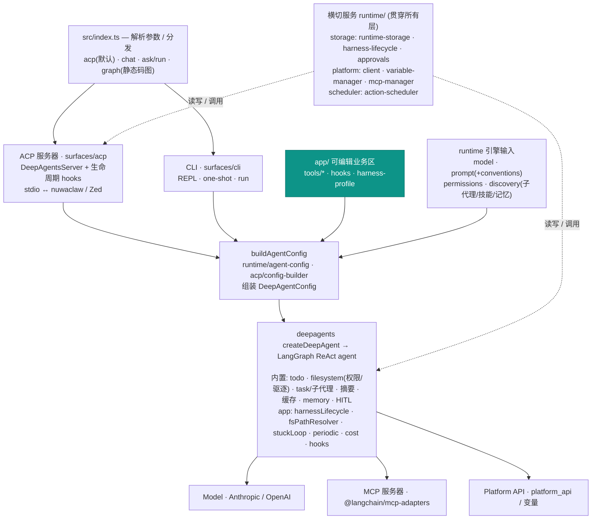
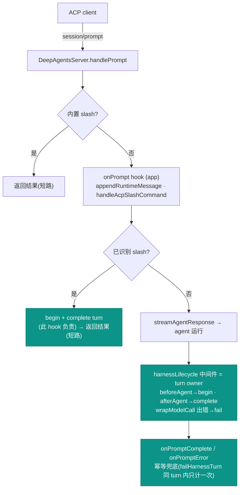
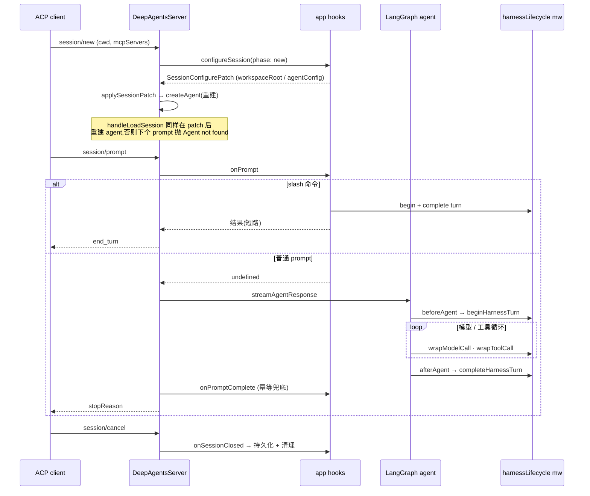

# 运行时架构 (Runtime Architecture)

`packages/deepagents-app-ts` 的整体架构与运行逻辑。三层分区遵循
[CLAUDE.md](../../CLAUDE.md) 的铁律:`app/` 可编辑业务区,`runtime/` + `surfaces/`
为受保护引擎,外部为依赖。

## 1. 包架构总览

入口 `src/index.ts` 按命令分发到两个运行面(ACP / CLI),两者最终汇到同一个
`buildAgentConfig` 收口点,组装出 `DeepAgentConfig` 交给 deepagents
`createDeepAgent`;横切服务贯穿所有层。

> 青色 = `app/` 可编辑业务区;其余为受保护引擎与外部依赖。

## 2. ACP prompt 运行流 & turn 生命周期归属

一次 prompt 的判定路径。**关键不变量:agent turn 的生命周期由
`harnessLifecycle` 中间件独占("SOLE owner");ACP hooks 只负责 slash 命令与失败兜底。**
两者若同时驱动 `begin/complete/fail` 会造成计数翻倍(见
[harness-lifecycle.ts](../../src/runtime/storage/harness-lifecycle.ts) /
[session-lifecycle.ts](../../src/surfaces/acp/session-lifecycle.ts))。

> 青色 = turn 生命周期归属者。普通 prompt 不在 `onPrompt` 里开 turn,否则与中间件的
> `beforeAgent` 双开 → `counters.turns` 翻倍。

## 3. 会话生命周期时序

`session/new` 经 `configureSession` 完成 per-session 工作区切换 / MCP 转发 /
agent 重建,随后 `session/prompt` 走第 2 节的判定。

## 关键文件

| 区域 | 路径 |
|---|---|
| 入口分发 | `src/index.ts` |
| ACP 面 | `src/surfaces/acp/{server,session-lifecycle,config-builder,slash-command-handler}.ts` |
| CLI 面 | `src/surfaces/cli/{repl,one-shot}.ts` |
| 配置装配 | `src/runtime/agent-config.ts`(`buildAgentConfigParts`) |
| 引擎输入 | `src/runtime/{model,prompt,permissions,discovery}.ts` |
| app 中间件 | `src/runtime/middleware/*.ts` |
| 横切服务 | `src/runtime/storage/*`、`src/runtime/platform/*`、`src/runtime/scheduler/*` |
| app 业务区 | `src/app/{tools,hooks,harness-profile}` |

外部 deepagents / deepagents-acp 范式对齐说明见
[nuwaclaw-engine-integration.md](./nuwaclaw-engine-integration.md)。
